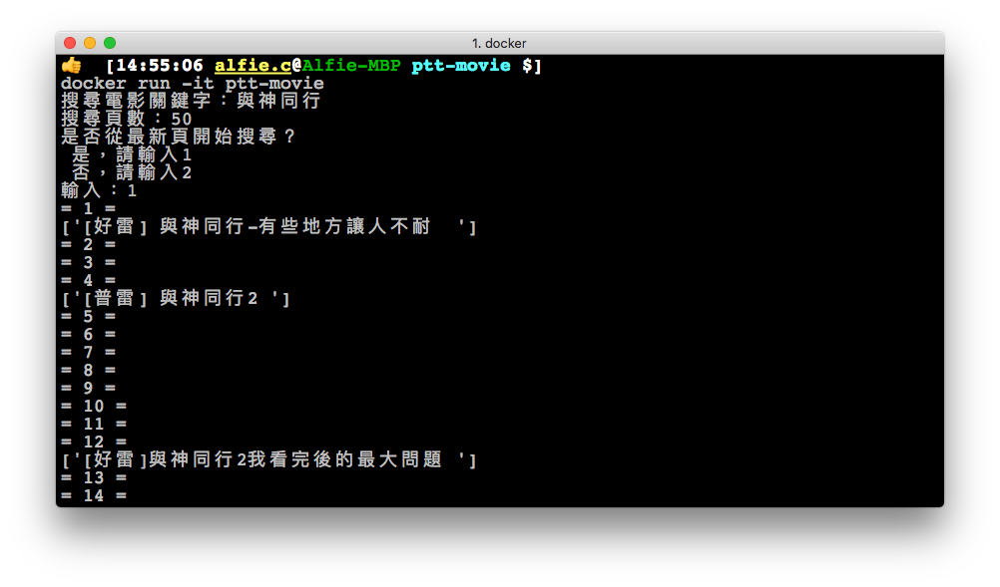

# PTT電影板爬蟲程式

* 了解特定電影目前的熱門程度，與新聞廣告效益
* 確認電影的普遍評價，反映觀眾感官

<p align="center">


</p>

<hr>

## 使用方法
於下列[方法ㄧ](#method1)、[方法二](#method2)之中擇一使用

<a name="method1"></a>

### 方法一：本機 Python3 安裝

https://realpython.com/installing-python/

執行以下 `pip3 install`：
```bash
$ pip3 install plotly
$ pip3 install beautifulsoup4
```

- [ ] _尚缺 plot.ly 帳號申請、產生圖表的設定說明_

執行程序：
```bash
$ python3 ptt-movie.py
```

- [ ] _尚缺截圖_

<a name="method2"></a>

### 方法二：打包 Docker 容器

https://docs.docker.com/install/

執行以下 `docker` 命令：
```bash
$ docker build -t ptt-movie .
$ docker run -it ptt-movie
```

<p align="center">

</p>
